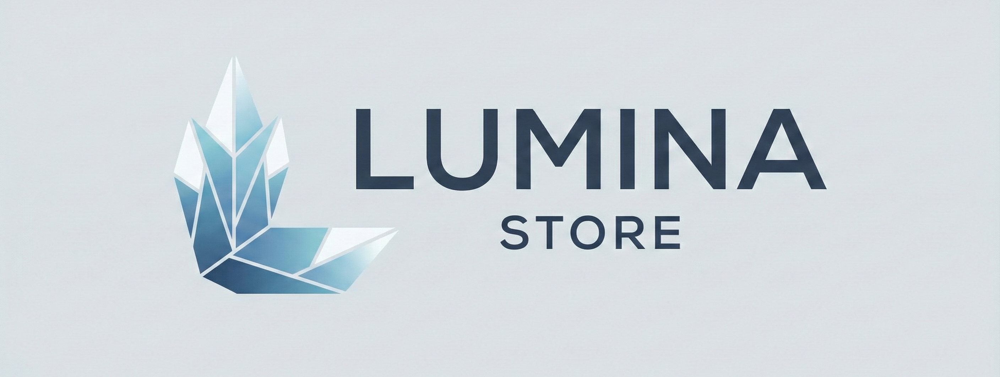

# Lumina Store



[](https://yarnpkg.com/)
[](https://vuejs.org/)
[](https://www.typescriptlang.org/)
[](https://daisyui.com/)
[](https://pinia.vuejs.org/)


Lumina Store is a practice project built to improve Vue.js skills and explore modern frontend development patterns. This e-commerce application demonstrates the implementation of a complete shopping experience with state management, routing, and dynamic content.

## Features

### State Management with Pinia
- **Shopping Cart Store**: Manages cart items with add, remove, increment, and decrement operations
- **Product State**: Tracks product amounts and calculates total prices automatically
- **Theme Store**: Handles dark/light mode preferences
- **Reactive Updates**: Real-time cart updates using Vue's reactivity system with watchers

### Routing
- **Vue Router Integration**: Complete navigation system with nested routes
- **Dynamic Routes**: Product detail pages with dynamic `:id` parameters
- **Route Structure**:
  - Home page
  - Products listing page
  - Individual product pages (dynamic)
  - About Us page
  - Contact page

### UI Components
- **Reusable Components**: Product cards, skeletons, breadcrumbs, and more
- **Layout System**: Consistent app layout with header, footer, and navigation
- **Responsive Design**: Mobile and desktop menu implementations
- **Theme Toggle**: Dark/light mode switcher
- **Shopping Cart Drawer**: Interactive cart with product management

### Additional Features
- Product filtering and categorization
- Related products section
- Brand showcase
- Timeline component for company history
- FAQ section
- Skeleton loaders for better UX

## Tech Stack

- **Vue.js 3.5** - Progressive JavaScript framework
- **TypeScript** - Type-safe development
- **Pinia** - State management
- **Vue Router** - Client-side routing
- **Tailwind CSS 4.1** - Utility-first CSS framework
- **DaisyUI** - Tailwind CSS component library
- **Vite** - Fast build tool
- **Lucide Vue** - Icon library


## Project Structure

```
src/
├── components/       # Reusable Vue components
│   ├── about/       # About page components
│   ├── footer/      # Footer components
│   ├── header/      # Header and navigation
│   ├── home/        # Home page sections
│   ├── productPage/ # Product detail components
│   ├── shared/      # Shared components
│   └── layout/      # Layout components
├── pages/           # Page components
├── router/          # Vue Router configuration
├── stores/          # Pinia stores
├── services/        # API services
├── types/           # TypeScript type definitions
└── utils/           # Utility functions and data
```

## This project helped practice:
- Vue 3 Composition API
- Pinia store patterns and state management
- Vue Router with dynamic routes
- TypeScript integration with Vue
- Reactive data handling with watchers
- Modern CSS with Tailwind and DaisyUI

## License

This is a practice project for educational purposes.
